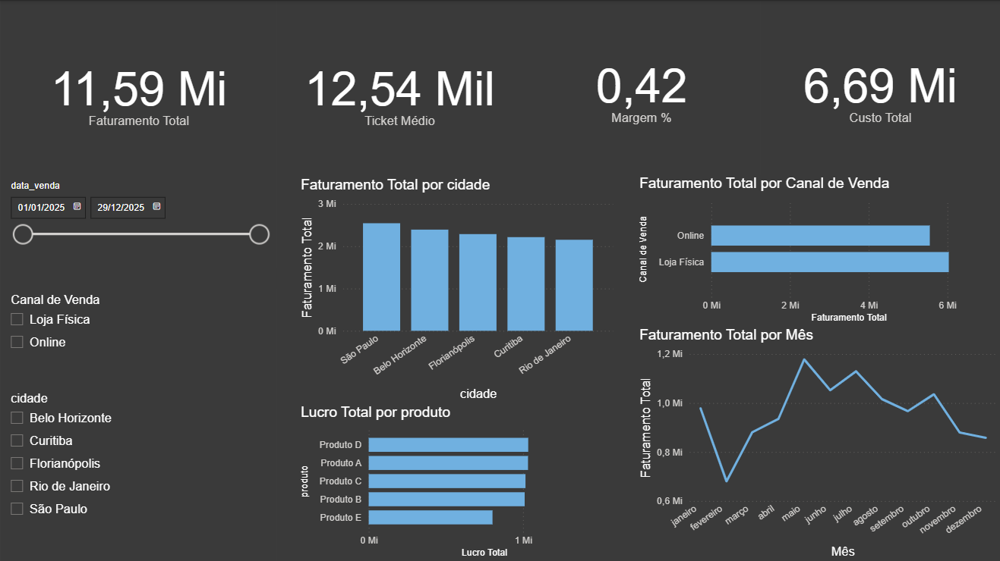

# Projeto de Análise de Vendas 2025

## **Descrição**

Este projeto tem como objetivo analisar dados de vendas do ano de 2025, gerando insights sobre faturamento, lucro, margem e desempenho por cidade, produto e canal de venda. A análise foi realizada utilizando **Python para ETL** e **Power BI para visualização interativa**.

## **Objetivo**

* Processar dados brutos de vendas e clientes.
* Corrigir inconsistências nos dados e calcular métricas importantes (lucro, margem %).
* Criar dashboards interativos que permitam análise por data, cidade, produto e canal de venda.

## **Ferramentas utilizadas**

* **Python 3.11+**: para processamento e transformação de dados (ETL).
* **Pandas**: manipulação de dados.
* **SQLite / CSV**: armazenamento intermediário dos dados.
* **Power BI Desktop**: criação de dashboards e visualizações interativas.

## **Estrutura do projeto**

```
caseAnaliseVendas/
│
├─ etl_vendas.py          # Script Python para ETL e limpeza de dados
├─ populate_db.py         # (opcional) script para gerar dados de exemplo
├─ vendas_limpo.csv       # Arquivo CSV final para análise
├─ dashboard_vendas.pbix  # Arquivo Power BI com dashboards
└─ README.md              # Documentação do projeto
```

## **Instruções para reproduzir o projeto**

1. **Clonar o repositório**

```bash
git clone https://github.com/seuusuario/caseAnaliseVendas.git
cd caseAnaliseVendas
```

2. **Criar e ativar ambiente virtual**

```bash
python -m venv .venv
# Windows
.venv\Scripts\activate
# macOS/Linux
source .venv/bin/activate
```

3. **Instalar dependências**

```bash
pip install pandas
```

4. **Gerar CSV de vendas limpo**

```bash
python etl_vendas.py
# Isso vai gerar o arquivo 'vendas_limpo.csv'
```

5. **Abrir o Power BI**

* Abrir o arquivo `dashboard_vendas.pbix` ou importar `vendas_limpo.csv`.
* Conferir que os campos `valor_venda`, `custo`, `lucro`, `margem_pct` estão como **Decimal Number** e `data_venda` como **Date**.
* Interagir com **slicers** para filtrar por data, cidade ou canal.

## **Principais métricas no dashboard**

* Faturamento Total
* Lucro Total
* Margem %
* Ticket Médio
* Evolução de vendas ao longo do ano (gráfico de linha)
* Desempenho por cidade, produto e canal (gráficos de barras)

## **Exemplo de visualizações**



## **Conclusão**

Este projeto demonstra a capacidade de:

* Coletar, limpar e transformar dados utilizando Python.
* Criar dashboards interativos e intuitivos no Power BI.
* Apresentar métricas de negócio relevantes para tomada de decisão.

## **Autor**

**Nicolas Gabriel**
nicolasgbleal@gmail.com
[LinkedIn](https://www.linkedin.com/in/nicolas-rodrigues-leal/) | [GitHub](https://github.com/NicolasGayb)
